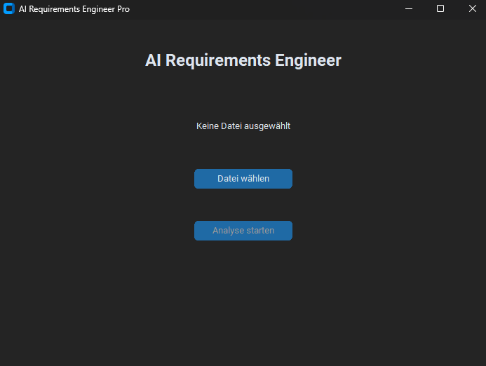
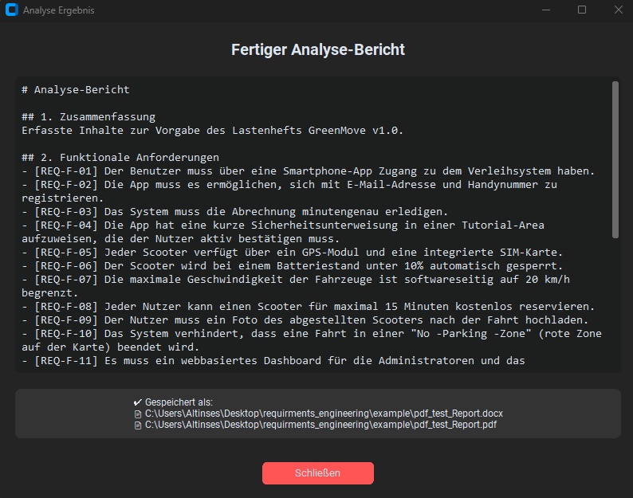
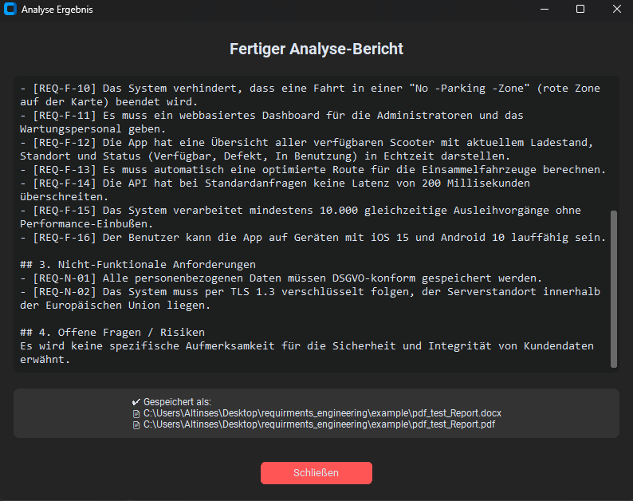

# 🤖 AI Requirements Engineer

A modern desktop application that uses **Local LLMs (Large Language Models)** to automatically analyze software requirements documents. It reads PDF or Word files, extracts functional and non-functional requirements, and exports a professional report—**100% locally and offline** for maximum data privacy.

---

## ✨ Features

* **📄 Multi-Format Support:** Reads `.pdf` and `.docx` (Word) files.
* **🧠 Local AI Intelligence:** Uses the **Qwen 2.5 (3B)** model via Ollama to analyze text without sending data to the cloud.
* **🧹 Smart Preprocessing:** Automatically cleans artifacts, page numbers, and formatting issues from raw text.
* **📊 Structured Output:** Classifies requirements into:
* Functional Requirements
* Non-Functional Requirements
* Risks & Open Questions


* **💾 Auto-Export:** Automatically saves the analysis as formatted **PDF** and **Word** reports.
* **🎨 Modern UI:** Built with `CustomTkinter` for a clean, dark-mode interface.

---

## 🛠️ Prerequisites

Before running the application, you need to set up the AI Engine.

### 1. Install Ollama (The AI Engine)

This application relies on **Ollama** to run the AI model locally.

1. Download Ollama from [ollama.com](https://ollama.com/download).
2. Install it on your system.
3. Ensure it is running (you should see a llama icon in your taskbar).

### 2. Download the Model

Open your terminal (Command Prompt / PowerShell) and run the following command to download the specific model used by this tool:

```bash
ollama pull qwen2.5:3b

```

*(Note: This download is approx. 1.9 GB. You can change the model in `core/analyzer.py` if you prefer Llama 3 or others.)*

---

## 🚀 Installation & Setup

### 1. Clone the Repository

```bash
git clone https://github.com/Diyarino/requirements-engineering.git
cd requirements-engineering

```

### 2. Set up Python Environment (Recommended)

```bash
# Create virtual environment
python -m venv venv

# Activate (Windows)
venv\Scripts\activate

# Activate (Mac/Linux)
source venv/bin/activate

```

### 3. Install Dependencies

```bash
pip install -r requirements.txt

```

---

## 💻 Usage

### Running from Source

Simply execute the main script:

```bash
python main.py

```

1. Click **"1. Datei wählen"** to select your requirements document (PDF/DOCX).
2. Click **"2. Analyse starten"**.
3. Wait for the AI to process the text (Progress bar will indicate activity).
4. A result window will open, and the reports (`.pdf` and `.docx`) will be saved in the same folder as your input file.

<p align="center">
  
  
  
</p>

### Building an Executable (.exe)

If you want to create a standalone application to share with colleagues:

```bash
python build_exe.py

```

The finished `.exe` will appear in the `dist/` folder.

---

## 📂 Project Structure

```text
AI-Requirements-Engineer/
├── core/                   # Backend Logic
│   ├── analyzer.py         # AI Interaction (Ollama)
│   ├── exporter.py         # PDF/Docx Generation
│   └── file_handler.py     # File Reading & Preprocessing
├── ui/                     # User Interface
│   ├── main_window.py      # Main GUI (CustomTkinter)
│   └── result_window.py    # Popup for Results
├── main.py                 # Entry Point
├── config.py               # Settings
├── setup_model.bat         # Helper script for model setup
└── requirements.txt        # Python Dependencies

```

---

## 🛡️ Privacy & Security

This tool was designed with data security in mind. Unlike ChatGPT or cloud-based tools, **no data leaves your computer**. The document analysis happens entirely within your local Ollama instance. This makes it suitable for confidential business documents (NDAs).

---

## 📝 License

This project is open source. Feel free to modify and distribute.

---

